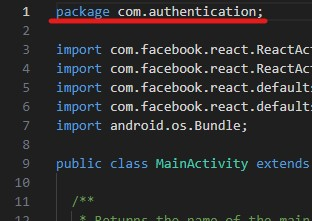
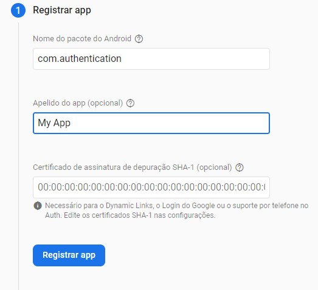
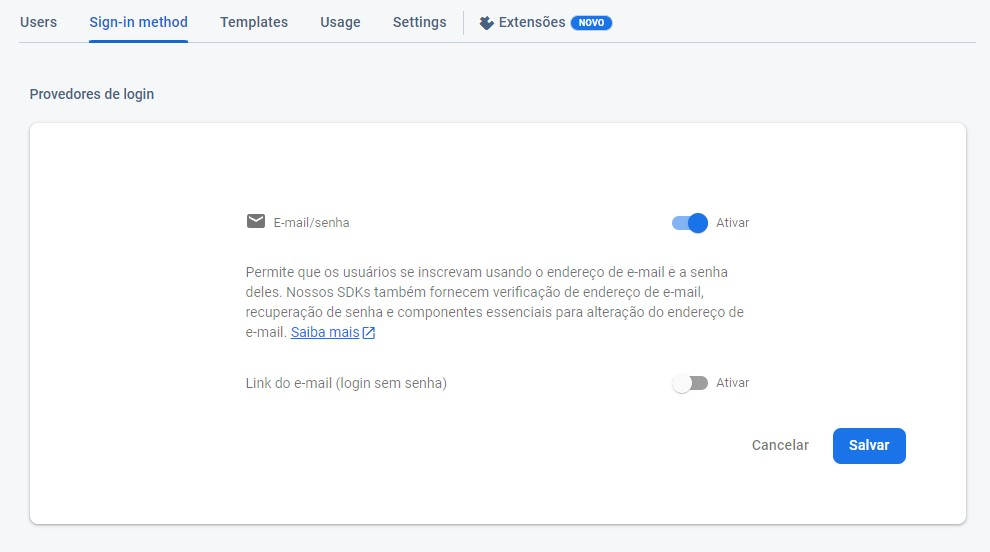

# Authentication (Android)

In this application we have the login screens, signUp, forgotPassword, all screens work using firebase authentication.

## Installation

To run de project we need first to configure it with the firebase.

* Log in to firebase and go to the console and create a new project.

* After creating a project, we will add an android app by clicking on this button.


* To register our android app we will need the package name of our project, to find the name go to the following folder ``./android/app/src/main/java/MainActivity.java`` where we will find the package name there on the top.



* Then put our package name in firebase and register our app.



* Then let's download the 'google-services.json' file and add it to our ``'android/app'`` folder.

* Now i just have to enable the authentication in firebase, we go in ‘authentication’ and add a new signin method, we gonna enabled the email/password method and save it.



## Installing dependencies

To install we can use npm or yarn

Installing with npm:
```bash
  npm install
```

Installing with yarn:
```bash
  yarn
```

## Running the app

To run the app you will need first to start de development server with the command:

```bash
  npm start
```

After the server start open a new cmd tab and run the following command:

```bash
  npm run android
```

This will open your android emulator, install all the dependencies and configuration and in the final your app will run.
